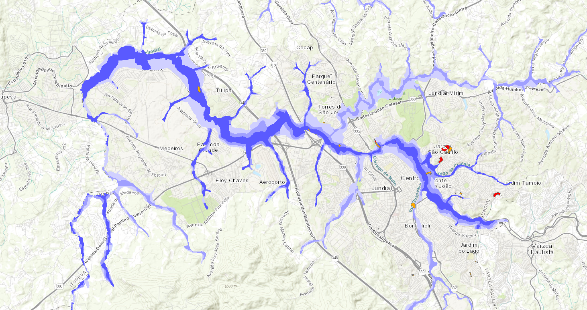
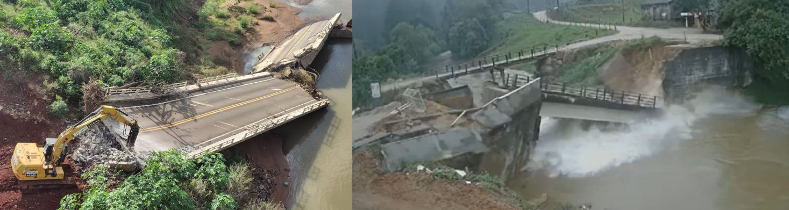
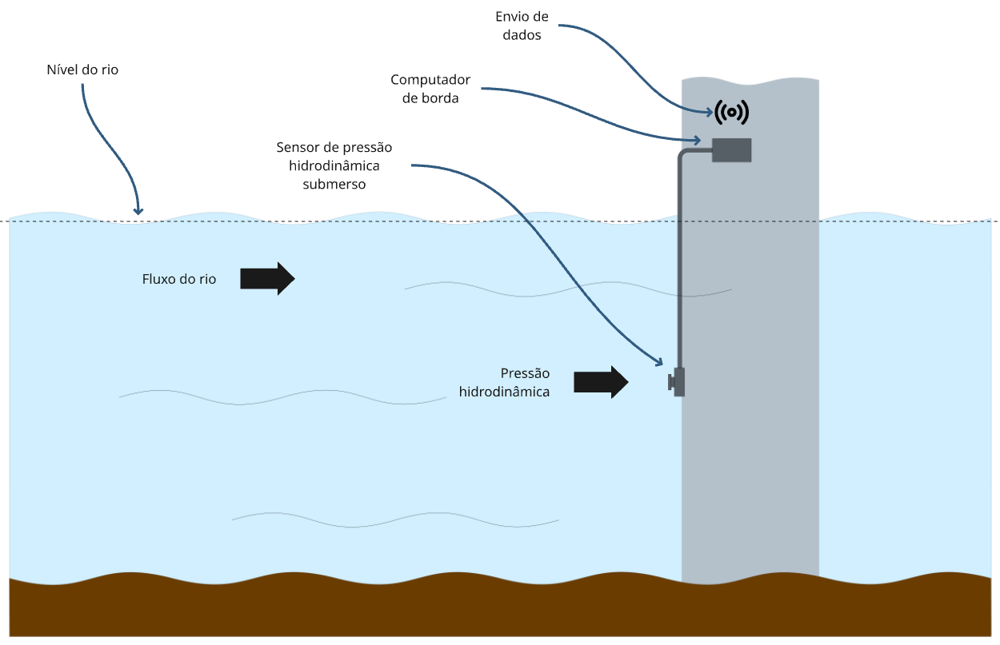
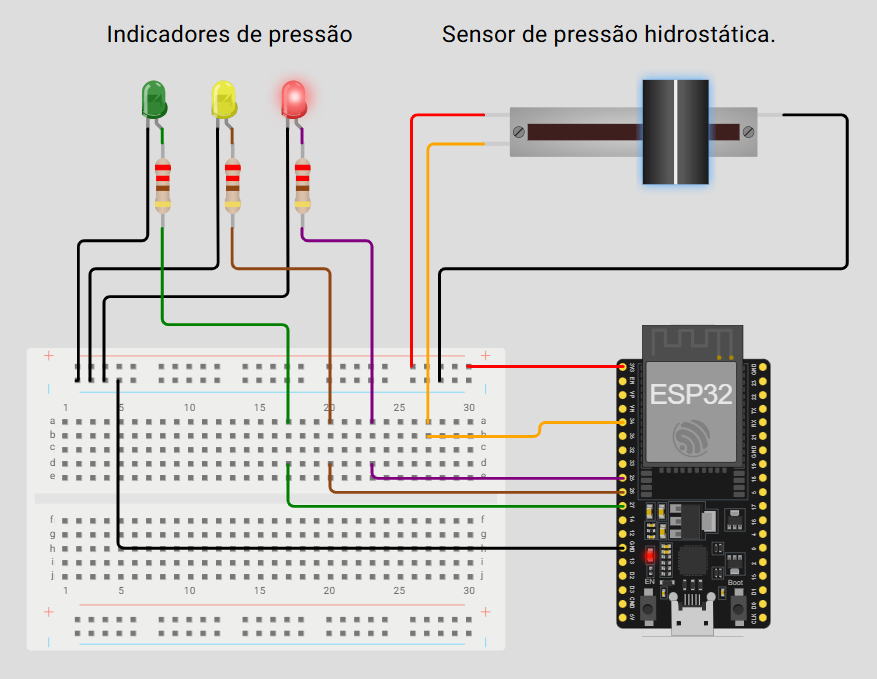

## FIAP - Faculdade de Informática e Administração Paulista

    

 

# Global Solution - 1/25

## Grupo TiãoTech

## 👨‍🎓 Integrantes
- <a href="https://www.linkedin.com/in/edmilson-marciano-02648a33">Edmilson Marciano</a>
- <a href="https://www.linkedin.com/in/jayromazzi">RM565576 - Jayro Mazzi Junior</a>
- <a href="https://www.linkedin.com/in/lucas-a-5b7a70110">RM563353 - Lucas Arcanjo</a>
- <a href="https://www.linkedin.com/in/vinicius-andrade-01208822b">RM564544 - Marcus Vinicius de Andrades Silva Malaquias</a>

## 👩‍🏫 Professores

### Tutor
- <a href="https://www.linkedin.com/in/lucas-gomes-moreira-15a8452a">Lucas Gomes Moreira</a>
### Coordenador
- <a href="https://www.linkedin.com/in/andregodoichiovato">Andre Godoi Chiovato</a>

## Introdução

Grandes desastres, sejam eles naturais ou desencadeados por ações humanas, têm sido causadores de transtornos para as populações ao longo dos séculos. Por outro lado, transformações climáticas recentes têm aumentado a incidência desse tipo de fenômeno em todo o planeta. Esse é de fato um campo crítico que tem suscitado o investimento de muitos recursos na busca de soluções e é justamente onde a IA pode ter um impacto transformador. 

Podemos considerar que o contexto em se desenvolveu este projeto simula aspectos da própria realidade, ou seja, acidentes de grandes proporções, naturais ou não, são situações extremas, em que a necessidade de otimizar tempo e recursos se sobrepõe à busca de soluções completas e definitivas.

Nesse aspecto, a realidade do nosso país nos propõe desafios de grandes proporções. A título ilustrativo, recentes estudos mostram que cerca de 2000 municípios apresentam vulnerabilidades para acidentes naturais [^1], como enchentes, movimentações de terrenos etc. Outro estudo mostra que, devido ao aquecimento global, a ocorrência desse tipo de desastre pode duplicar a cada grau centígrado de aumento na temperatura do planeta [^2].

*Mapa de região considerada, propensa a enchentes, próxima a Jundiaí - SP*

### Enchentes - Nossa oportunidade de contribuição

Enchentes estão entre os fenômenos que mais afetam a vida dos brasileiros. Não é difícil imaginar um rio que é historicamente palco de inúmeras cheias, causando transtornos às populações que vivem nas cidades às suas margens. Alguns equipamentos de infraestrutura ao longo do rio tornam-se pontos de atenção por sua importância estratégica, entre os quais destacamos pontes, barragens, usinas etc. As alterações no comportamento do rio colocam em risco a integridade desses equipamentos, exigindo das autoridades constantes esforços preventivos que assegurem à população a disponibilidade desses recursos tão necessários ao seu bem-estar.

*Imagens de danos a pontes causados por enchentes.*

Por outro lado, os municípios mais vulneráveis são justamente aqueles que carecem de recursos financeiros para a implementação de soluções de prevenção e mitigação de danos, que possam proteger a sua já deficiente infraestrutura.
De uma forma ampla, o que se pretende é conceber uma solução de baixo custo que possa ajudar justamente os municípios mais vulneráveis.

## A solução
O propósito da solução proposta é o de fornecer informações avançadas sobre eventos climáticos que possam trazer riscos aos equipamentos em questão, como segue:
- Alertas sobre a severidade de eventos futuros a médio prazo e predição de magnitude dos riscos, para o planejamento de ações prévias de mitigação.
- Alertas críticos sobre eventos críticos em andamento para ações imediatas de proteção da população.
Relatórios de manutenção preditiva, com sugestões de correções e reparos.

### Hipóteses
A presente demanda pretende demonstrar a eficácia desse tipo de solução, com base na hipótese de que a análise combinada de dados históricos sobre as alterações do rio, dos equipamentos que se deseja monitorar, previsões meteorológicas e dados de sensoriamento dos equipamentos para vibração, deslocamento etc. possa ocultar padrões de comportamento que possam assinalar com a antecedência devida a ocorrência de eventos críticos para a infraestrutura tratada.

### A prova de conceito (POC)
A presente demanda compreende a realização de uma POC que, como um protótipo da solução completa idealizada, ofereça as seguintes funcionalidades:
- Monitoramento do rio
- Monitoramento de um equipamento de infraestrutura relacionado (no caso, uma ponte)
- Emissão de alertas sobre eventos climáticos no rio
- Emissão de alertas sobre riscos à integridade do equipamento monitorado

### Solução técnica

#### Dados históricos

A solução utiliza dados históricos reais[^3] para o treinamento do modelo de ML, adaptados para as nossas necessidades, ou seja, à série histórica que fornecia apenas a data de coleta e o nível do rio, foi acrescentado também o dado de pressão hidrodinâmica calculada, simulando a resposta o sensor.

O cálculo da pressão é explicado mais adiante, no item [Dados de monitoramento](#dados-de-monitoramento)

#### Dados de monitoramento

##### Composição do kit de borda

A solução adotada simula o posicionamento de um sensor hidrodinâmico na pilastra mais exposta da ponte, ou seja, a que recebe maior efeito das variações de pressão hidrodinâmica com a mudança de nível e vazão do rio.

*Configuração do kit de borda*

##### Simulação do kit de borda

Utilizamos o Wokwi para construir o protótipo virtual do kit de borda e gerar os dados fictícios do sensor.
Como computador de borda, usamos o ESP32.
Para simular o sensor de pressão hidrostática, utilizados um potenciômetro que nos permitiu variar o nível de saída. 
Os valores de saída do potenciômetro variam entre 0 e 4095. Como a faixa de valores de pressão hidrostática deveria estar entre 180 e 700 kPa, foi necessário mapear as duas faixas para obter os valores na faixa necessária (document/sensor_diagram/sketch.ino, linha 50).
O kit de simulação contava ainda com leds coloridos indicativos da faixas de pressão normal, em alerta e m emergência.

Geramos cerca de 60 leituras, que foram impressas na saída serial e copiadas para um arquivo texto.

##### Cálculo da pressão

Em função da indisponibilidade de dados suficientes (não temos histórico de vazão), adotamos uma forma simplificada, considerando apenas os dados de nível do rio. Obviamente essa premissa deve ser reconsiderada para o efetivo desenvolvimento da solução, mas é válida para o contexto da POC.

Embora o sensor tenha posição fixa na pilastra, consideramos que a mudança de nível do rio causa uma mudança na pressão hidrodinâmica geral, que pode ser calculada a partir dos dados do sensor, usando-se uma fórmula de compensação simplificada, conforme segue:

$$
P = (k_1 \times N ) + (k_2 \times n^2) + R
$$

Onde:

- *P* = Pressão na Pilastra (*kPa*)
- *N* = Nível da Água do Rio (*m*)
- *k1* = Constante linear (simulando a pressão hidrostática base) (*kPa/m*).
- *k2* = Constante quadrática (simulando o aumento acelerado em níveis altos) (*kPa/m2*).
- *R* = Ruído. Pequeno valor aleatório (positivo ou negativo) (*kPa*).

### Modelo de Machine Learning e Lógica de Alertas

É a parte central da solução e também a mais complexa, nem tanto na execução, mas na concepção.

#### Objetivo e abordagem do ML
O modelo de Machine Learning tem como objetivo prever a **ocorrência de danos na ponte** com base nos dados de pressão da água, complementando as regras de engenharia.
Para este problema, que envolve classificação binária (cheia/não cheia), optamos pela **Regressão Logística**, devido à sua interpretabilidade facilitada, eficiência computacional e capacidade de fornecer probabilidades de ocorrência, que são essenciais para graduar a severidade dos alertas.

#### Preparação dos Dados para o ML
- Os dados históricos de pressão – `reading_calculated_water_pressure` – foram utilizados como feature (variável de entrada) para o modelo.
- A variável alvo (target) para o treinamento foi a `flag_flood`, que indica a ocorrência de uma cheia (1 para cheia, 0 para não cheia) conforme o histórico.
- Os dados foram divididos em conjuntos de treino (80%) e teste (20%) para avaliar o desempenho do modelo de forma justa.

#### Treinamento e Avaliação do Modelo
- O modelo foi treinado com o conjunto de dados de treinamento.
- Após o treinamento, o modelo foi avaliado no conjunto de testes para verificar sua acurácia e capacidade de generalização. As métricas de Acurácia e o Relatório de Classificação (precisão, recall, f1-score) foram utilizados para medir seu desempenho.

(resultados)

#### Lógica de Alertas Integrada (ML + Engenharia)
Talvez o maior diferencial na concepção deste projeto é poder unir duas abordagens diferentes para o mesmo objetivo, já que a solução não depende apenas do modelo de ML. Ela integra uma lógica de alerta híbrida, combinando a previsão do modelo com regras de engenharia pré-definidas.
- **Regras de Engenharia**: Definimos limites de pressão (equip_charge_rupture_limit e equip_safety_factor) específicos para cada ponte para identificar situações de risco iminente à estrutura. Se a pressão medida excede esses limites de segurança, um alerta é emitido independentemente da previsão do ML.
- **Alerta por Machine Learning**: O modelo de Regressão Logística calcula a probabilidade de ocorrerem danos. Se essa probabilidade exceder um determinado limiar (ex: 70%), um alerta é disparado.
- **Severidade**: A solução define diferentes níveis de severidade (ex: Normal, Atenção, Crítico) com base na combinação dos alertas de engenharia e ML. O maior nível de severidade entre os dois é sempre o considerado para a mensagem final.
Essa abordagem garante que tanto os riscos diretos à estrutura (engenharia) quanto os padrões preditivos de cheia (ML) sejam considerados, oferecendo um sistema de alerta mais robusto e confiável.

### Interface do Usuário 

#### Objetivo da Interface
Para demonstrar e visualizar os alertas em tempo real de forma amigável, foi desenvolvida uma interface de usuário web interativa utilizando Streamlit, cujo objetivo principal é permitir que as autoridades ou operadores monitorem facilmente a situação da ponte e recebam avisos claros sobre potenciais riscos.

#### Funcionalidades Principais
- **Visualização de leituras simuladas**: A interface apresenta as leituras de pressão da água em tempo real, simuladas a partir de um conjunto de dados históricos.
- **Indicadores visuais de alerta**: A pressão atual é exibida com cores e mensagens que indicam o status do alerta (Verde para normal, Amarelo/Laranja para atenção, Vermelho para crítico), baseadas na lógica híbrida de ML e engenharia.
- **Histórico de pressão**: Um gráfico em tempo real mostra a tendência da pressão da água ao longo do tempo, permitindo observar as variações e a evolução dos alertas.
- **Controle da simulação**: Botões intuitivos permitem iniciar e pausar a simulação das leituras, facilitando a demonstração e o teste do sistema.

### Algumas ideias para implementação futura 
- **Aprimoramento do modelo de ML**: Inclusão de novas features (ex: dados de chuva, nível do rio a montante, temperatura) para aumentar a acurácia e a antecedência da previsão.
- **Integração com sensores reais**: Conexão com ESP32 real para leitura de dados em campo.
- **Notificações**: Implementação de sistemas de notificação (SMS, e-mail) para alertas críticos.
- **Relatórios detalhados**: Geração de relatórios com histórico de eventos e desempenho do sistema.
- **Especificação do modelo de comunicação**: Definir modelos de rede e protocolos e a necessidade de múltiplos sensores.
- **Aprimoramento da arquitetura da solução**: Desenvolver as APIs necessárias para proteção dos dados e para integração com outros sistemas.

## 📁 Estrutura de pastas

- <b>assets</b>: imagens e outros artefatos.

- <b>document/data_-_inception</b>: arquivos de dados (CSVs).
- <b>document/sensor_diagram</b>: arquivos para simulação dos sensores.
- <b>scripts</b>: scripts SQL para construção e população inicial do banco de dados.
- <b>src</b>: scripts e códigos da solução
- <b>GS_1_Sem_2025.ipynb</b>: arquivo do Google Colab, com o modelo de ML, interface de usuário e lógica de alertas.
- <b>README.md</b>: descrição geral do projeto (este documento que você está lendo agora).

## Referências
[^1]: [Brasil tem 1.942 cidades com risco de desastre ambiental](https://educacao.cemaden.gov.br/midiateca/nota-tecnica-no-1-2023-sadj-vi-sam-cc-pr/)
[^2]: [Cemaden aponta aumento de riscos de deslizamentos e inundações no Brasil, em projeções de aquecimento global](http://www2.cemaden.gov.br/cientistas-do-cemaden-apontam-aumento-de-risco-de-deslizamentos-e-inundacoes-no-brasil-em-projecoes-de-aquecimento-global-acima-de-2o-c/)
[^3]: [DAEE-SP](https://cth.daee.sp.gov.br/sibh/)

## Vídeos explicativos

Veja em https://youtu.be/nNdhJLdcfbo e https://youtu.be/CeQ5-fFtwWU 

## 📋 Licença

<a property="dct:title" rel="cc:attributionURL" href="https://github.com/agodoi/template">MODELO GIT FIAP</a> por <a rel="cc:attributionURL dct:creator" property="cc:attributionName" href="https://fiap.com.br">Fiap</a> está licenciado sobre <a href="http://creativecommons.org/licenses/by/4.0/?ref=chooser-v1" target="_blank" rel="license noopener noreferrer" style="display:inline-block;">Attribution 4.0 International</a>.

